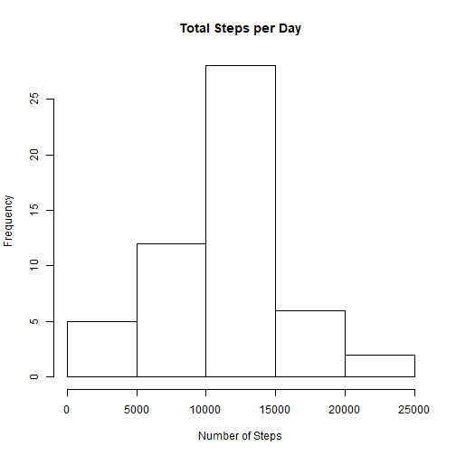

  
  
## Loading and preprocessing the data

``` 
install.packages("ggplot")
if (!file.exists('activity.csv')) {unzip(zipfile = "activity.zip")}
activityData <- read.csv(file="activity.csv", header=TRUE)
```

## What is mean total number of steps taken per day?

Calculate the total steps taken per day

```
totalSteps <- aggregate(steps ~ date, activityData, FUN=sum)
head(totalSteps)
```


```
## Installing package into 'C:/Users/kaushik/Documents/R/win-library/3.6'
## (as 'lib' is unspecified)
```

```
## Warning in install.packages :
##   package 'ggplot' is not available (for R version 3.6.3)
```

```
##         date steps
## 1 2012-10-02   126
## 2 2012-10-03 11352
## 3 2012-10-04 12116
## 4 2012-10-05 13294
## 5 2012-10-06 15420
## 6 2012-10-07 11015
```

Make a histogram of the total number of steps taken per day

```
hist(totalSteps$steps,main = "Total Steps per Day",xlab = "Number of Steps")
```



Calculate and report the mean and median of total steps taken per day

```
meanSteps <- mean(totalSteps$steps, na.rm = TRUE)
medSteps <- median(totalSteps$steps, na.rm = TRUE)
meanSteps
medSteps
```


```
## [1] 10766.19
```

```
## [1] 10765
```

Mean and median number of steps taken each day - 10766.19, 10765


## What is the average daily activity pattern?

Make a time-series plot of the 5-minute interval and the average number of steps taken, averaged acoss all days.

```
library(ggplot2)
meanStepsByInt <- aggregate(steps ~ interval, activityData, mean)
ggplot(data = meanStepsByInt, aes(x = interval, y = steps)) +
  geom_line() +
  ggtitle("Average Daily Activity Pattern") +
  xlab("5-minute Interval") +
  ylab("Average Number of Steps") +
  theme(plot.title = element_text(hjust = 0.5))
```


Which 5-minute interval across all days contain the maximum number of steps

```
maxInt <- meanStepsByInt[which.max(meanStepsByInt$steps),]
maxInt
```


```
##     interval    steps
## 104      835 206.1698
```

The 5-minute interval that, on average, contains the maximum number of steps - 104 (835 206.1698 number of steps)


## Inputing missing values

Calculate and report the total number of missing values in the dataset

```
missingVals <- is.na(activityData$steps)
NATotal <- sum(missingVals)
NATotal
```


```
## [1] 2304
```

The total no. of missing values in the dataset is 2304.

Devise a strategy for filling in all of the missing values
There are a total of 2304 missing values. I replace these missing values with the 5-day averages of that respective interval.
Create a new dataset that is equal to the original dataset but with the missing data filled in.

```
imp_activityData <- transform(activityData,steps = ifelse(is.na(activityData$steps),
                                                        meanStepsByInt$steps[match(activityData$interval,meanStepsByInt$interval)],activityData$steps))
```

Make a histogram of the total number of steps taken each day and and report the mean and median.

```
impStepsByInt <- aggregate(steps ~ date, imp_activityData, FUN=sum)
hist(impStepsByInt$steps, main = "Imputed Number of Steps Per Day", xlab = "Number of Steps")
impMeanSteps <- mean(impStepsByInt$steps, na.rm = TRUE)
impMedSteps <- median(impStepsByInt$steps, na.rm = TRUE)
diffMean = impMeanSteps - meanSteps
diffMed = impMedSteps - medSteps
diffTotal = sum(impStepsByInt$steps) - sum(totalSteps$steps)
impMeanSteps
impMedSteps
```


```
## [1] 10766.19
```

```
## [1] 10766.19
```


The new calculated mean and median are equal and are equal to 10766.19. The new and old mean are the same but the median has shifted from 10765 to 10766.19.

## Are there differences in activity patterns between weekdays and weekends?

Create a new factor variable in the dataset with two levels - "weekend" and "weekday"

```
DayType <- function(date) {day <- weekdays(date)
if (day %in% c('Monday', 'Tuesday', 'Wednesday', 'Thursday', 'Friday'))
  return ("weekeday")
else if (day %in% c('Saturday', 'Sunday'))
  return ("weekend")
else
  stop ("Invalid Date Format.")}
imp_activityData$date <- as.Date(imp_activityData$date)
imp_activityData$day <- sapply(imp_activityData$date, FUN = DayType)
```

Make a panel plot containnig a time-series plot of the 5-minute interval and the average number of steps taken across all weekdays or weekends

```
meanStepsByDay <- aggregate(steps ~ interval + day, imp_activityData, mean)
ggplot(data = meanStepsByDay, aes(x = interval, y = steps)) + 
  geom_line() +
  facet_grid(day ~ .) +
  ggtitle("Average Daily Activity Pattern") +
  xlab("5-minute Interval") +
  ylab("Average Number of Steps") +
  theme(plot.title = element_text(hjust = 0.5))
```


